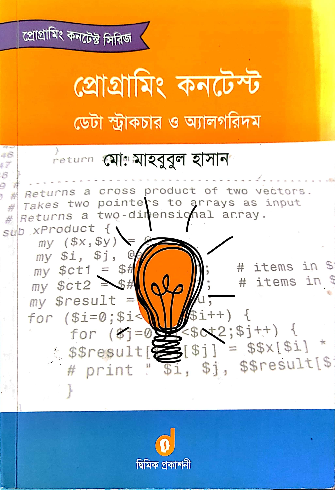

# Programing Contest Data Structure & Algorithm

🚀 **C/C++ and Competitive Programming Edition!** 🚀 
Hello fellow coders and enthusiasts! 👋 
Embark on an exciting coding journey with this repository dedicated to mastering C/C++ and sharpening your skills in competitive programming. Whether you're a beginner or seasoned coder, this collection of resources and solutions is crafted to elevate your proficiency in these versatile languages and enhance your problem-solving abilities. 
Here, I’m following the book named “Programming Contest Data Structure and Algorithm”

## The Chapter List:

01. Introduction
02. [C Review](https://github.com/sabboshachi/C-Cpp_Practice/tree/main/01.Programing_Contest_DataStructureAndAlgorithm/Chapter_2) 
03. Math
04. Sorting and Searching
05. Data Structure
06. Greedy Technique
07. Dynamic Programing
08. Graph
09. Adhoc Technique
10. Geometry and Computational Geometry
11. String Related Data Structure and Algorithm

Let this repository be your companion in the journey of mastering C/C++ and excelling in competitive programming. Happy coding! 🚀💻
